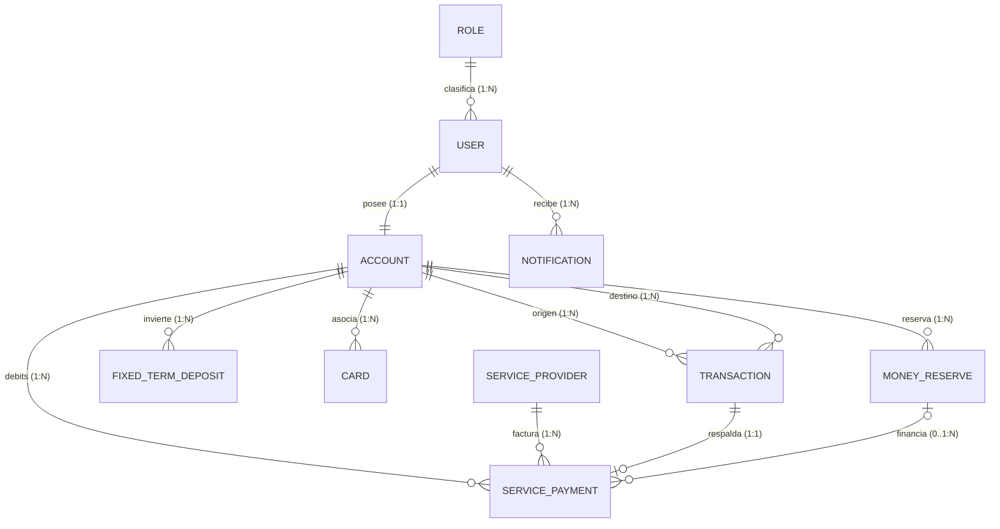

# DigitalArs — Billetera Virtual (Full Stack Solution)

> **Proyecto:** Billetera Virtual / Digital Wallet  
> **Programa:** Aceleración Técnica en **Alchemie Acceleration Tech**  
> **Equipo:** **Squad-stack** — Emmanuel, Andrés, Micaela y Máximo  
> **Stack Completo:** .NET 10 | ASP.NET Core Web API | Entity Framework Core 10 | SQL Server | ASP.NET Core Identity | JWT Bearer | React 19 | Vite | Material UI v6 | GSAP | jsPDF  

---

## 1. Descripción del Proyecto

**DigitalArs** es una solución fintech integral construida con arquitectura limpia (*Clean Architecture*), estándares bancarios y alta fidelidad visual. Proporciona una plataforma robusta y reactiva compuesta por:

1. **Backend Web API (.NET 10):** Servicio RESTful de alto desempeño con inyección de dependencias modular, transaccionalidad atómica (ACID), paginación optimizada a nivel de motor SQL Server (`OFFSET ... FETCH NEXT`), control de accesos basado en roles (*RBAC*), autenticación JWT y persistencia mediante Entity Framework Core 10.
2. **Frontend SPA (React 19 + Vite):** Aplicación web reactiva para usuarios y administradores, con soporte de Modo Oscuro semántico, fondo interactivo con físicas elásticas (`GSAP`), emisión de comprobantes oficiales en PDF (`jsPDF`), microinteracciones fluidas (`Motion`), diseño responsivo (móvil y escritorio) y navegación protegida por roles.

---

## 2. Stack Tecnológico de Punta a Punta

### Backend (C# / .NET 10)
| Componente | Tecnología | Versión | Rol en la Solución |
| :--- | :--- | :---: | :--- |
| **Runtime & SDK** | [.NET](https://dotnet.microsoft.com/) | `10.0` | Motor de ejecución principal compilado de alto rendimiento |
| **Web Framework** | [ASP.NET Core Web API](https://learn.microsoft.com/aspnet/core) | `10.0` | Pipeline HTTP, middlewares, filtros y controladores REST |
| **ORM** | [Entity Framework Core](https://learn.microsoft.com/ef/core) | `10.0` | Mapeo objeto-relacional *Code First*, Fluent API y migraciones |
| **Base de Datos** | Microsoft SQL Server / LocalDB | `2022+` | Persistencia relacional ACID con integridad referencial |
| **Seguridad e Identidad**| ASP.NET Core Identity | `10.0` | Gestión de usuarios, roles, claims y hash seguro PBKDF2 |
| **Autenticación** | JWT (JSON Web Tokens) | `Bearer` | Tokens criptográficos HMAC-SHA256 para sesiones sin estado |
| **Documentación** | OpenAPI / Swagger UI | `5.32+` | Explorador interactivo de endpoints REST |
| **Validación** | FluentValidation | `11.9+` | Validación declarativa de reglas de negocio en DTOs |

### Frontend (React 19 / JavaScript)
| Componente | Tecnología | Versión | Rol en la Solución |
| :--- | :--- | :---: | :--- |
| **Librería UI** | [React](https://react.dev/) | `19` | Arquitectura basada en componentes funcionales y hooks |
| **Tooling & Bundler** | [Vite](https://vite.dev/) | `8` | Entorno de desarrollo con HMR ultra veloz y empaquetado optimizado |
| **Componentes & UI** | [Material UI (MUI)](https://mui.com/) | `v6` | Sistema de diseño empresarial, tokens semánticos y accesibilidad |
| **Microinteracciones** | [Motion](https://motion.dev/) | `13` | Físicas de resorte, elevación al hover y feedback táctil |
| **Canvas Animado** | [GSAP](https://gsap.com/) | `3.14+` | Fondo reactivo interactivo de puntos con inercia en el Login |
| **Comprobantes PDF** | [jsPDF](https://github.com/parallax/jsPDF) | `4.2` | Generación y descarga en cliente de comprobantes bancarios |
| **Cliente HTTP** | [Axios](https://axios-http.com/) | `1.20` | Instancia singleton con interceptores automáticos de JWT |
| **Enrutamiento** | [React Router DOM](https://reactrouter.com/) | `7` | Navegación SPA declarativa con guardianes de autenticación y rol |

---

## 3. Requisitos Previos

Para ejecutar la solución completa en cualquier equipo de desarrollo se requiere:
1. **[.NET 10 SDK](https://dotnet.microsoft.com/download/dotnet/10.0)** (o superior).
2. **[Node.js](https://nodejs.org/)** (versión `18.0.0` o superior) y **npm** (`9.0.0` o superior).
3. **Microsoft SQL Server** (LocalDB incluido con Visual Studio, SQL Server Express o contenedor Docker).
4. **Herramienta EF Core CLI:**
   ```bash
   dotnet tool install --global dotnet-ef
   ```

---

## 4. Instalación y Puesta en Marcha

> 💡 **Garantía:** Siguiendo exclusivamente los pasos a continuación, cualquier desarrollador puede clonar, inicializar la base de datos y correr el sistema completo.

### Paso 1: Clonar Repositorios
```bash
# Repositorio Backend
git clone https://github.com/MicaMulato/Squad-stack.git
cd Squad-stack

# Repositorio Frontend (en directorio paralelo o adyacente)
git clone https://github.com/porrettimaximo/Squad-stack-Frontend.git
```

---

### Paso 2: Configuración y Ejecución del Backend

1. **Revisar cadena de conexión:**  
   El archivo `DigitalArs.Api/appsettings.json` viene preconfigurado para `(localdb)\\MSSQLLocalDB` (o use `appsettings.Example.json` como referencia):
   ```json
   "ConnectionStrings": {
     "DefaultConnection": "Server=(localdb)\\MSSQLLocalDB;Database=DigitalArsDb;Trusted_Connection=true;TrustServerCertificate=true;"
   }
   ```
2. **Aplicar Migraciones de Base de Datos y Precarga de Datos (*Seed*):**  
   Posicionado en la raíz de `Squad-stack`, ejecute:
   ```bash
   dotnet ef database update --project DigitalArs.Infrastructure --startup-project DigitalArs.Api
   ```
   *Esto creará automáticamente la base de datos `DigitalArsDb`, todas las tablas, relaciones, roles y usuarios de prueba.*

3. **Compilar y Ejecutar la API:**
   ```bash
   dotnet run --project DigitalArs.Api --launch-profile https
   ```
   *La API quedará escuchando en:*
   - **HTTPS:** `https://localhost:7142`
   - **HTTP:** `http://localhost:5065`
   - **Swagger UI interactivo:** `http://localhost:5065/swagger`

---

### Paso 3: Configuración y Ejecución del Frontend

1. **Posicionarse en el directorio del Frontend:**
   ```bash
   cd ../Squad-stack-Frontend
   ```
2. **Crear archivo de variables de entorno (opcional si usa el puerto HTTPS por defecto):**
   ```bash
   cp .env.example .env
   ```
   *Contenido de `.env`:*
   ```env
   VITE_API_URL=https://localhost:7142/api
   ```
3. **Instalar dependencias:**
   ```bash
   npm install
   ```
4. **Iniciar el servidor de desarrollo:**
   ```bash
   npm run dev
   ```
   *El frontend estará disponible en:* `http://localhost:5173`

---

## 5. Credenciales de Prueba (Datos Precargados)

La base de datos se inicializa con los siguientes usuarios listos para operar inmediatamente:

| Rol | Usuario / Nombre | Email | Contraseña | Saldo Inicial | Permisos y Vistas |
| :--- | :--- | :--- | :--- | :---: | :--- |
| **Admin** | Administrador DigitalArs | `admin@digitalars.com` | `Admin123!` | $500.000,00 | Panel de Gestión de Usuarios (`/admin`), control de roles, bloqueos y configuración de modo oscuro. |
| **User** | Roberto Carlos | `robercarlos3@gmail.com` | `Roberto1!` | $260.000,00 | Billetera completa (`/dashboard`), transferencias, depósitos, inversiones, tarjetas, servicios y reservas. |
| **User** | Mohammed Khan | `mokha@gmail.com` | `Mohammed1!` | $185.000,50 | Billetera completa (`/dashboard`), transferencias y comprobantes. |
| **User** | Alejandro Silva | `alejandro.silva@digitalars.com` | `User123!` | $45.230,50 | Usuario estándar con historial de movimientos. |
| **User** | Micaela Mulato | `micaela.mulato@digitalars.com` | `User123!` | $320.000,00 | Usuario estándar con inversiones y tarjetas. |
| **User** | Emmanuel Torres | `emmanuel.torres@digitalars.com` | `User123!` | $410.000,00 | Usuario estándar con apartados de reserva. |

> 🔒 **Seguridad de Passwords:** Todas las contraseñas están almacenadas mediante el algoritmo PBKDF2 con salt criptográfico de ASP.NET Core Identity.

---

## 6. Diagrama Entidad-Relación (ER Diagram Actualizado)

El modelo de datos relacional soporta el ecosistema financiero completo:



> 📄 **Documentación Detallada del Modelo Relacional:**  
> Consulta el desglose completo de entidades, tipos, índices y restricciones en:  
> 👉 [docs/diagrama-er.md](docs/diagrama-er.md)

---

## 7. Módulos y Endpoints Principales de la API

- **Autenticación (`/api/auth`):** Login con emisión de JWT y registro de nuevos usuarios.
- **Cuentas y Saldo (`/api/accounts`):** Saldo en tiempo real (`/balance`), depósitos con validación (`/deposit`) y datos del titular (`/me`).
- **Transferencias (`/api/transactions`):** Transferencias atómicas entre cuentas (`/transfer`) e historial paginado en base de datos (`/history`).
- **Inversiones a Plazo Fijo (`/api/fixedterm`):** Constitución con TNA garantizada, cálculo de intereses y cancelación anticipada.
- **Tarjetas (`/api/cards`):** Emisión de tarjetas virtuales y físicas, congelamiento/descongelamiento instantáneo (`/toggle-freeze`).
- **Pago de Servicios (`/api/services`):** Catálogo categorizado de empresas (`/providers`), consulta simulada de deuda (`/simulate-invoice`) y pago con comprobante (`/pay`).
- **Reservas de Dinero (`/api/reserves`):** Creación de metas de ahorro, ingreso de fondos y retiro de saldo hacia la cuenta principal.
- **Notificaciones (`/api/notifications`):** Listado cronológico de alertas (`/me`), contador de no leídas (`/unread-count`) y marcado como leídas (`/mark-read`).
- **Administración (`/api/users`):** Listado paginado de usuarios para administradores, asignación de roles y baja lógica (*Soft Delete*).

---

## 8. Reportes de Optimización y Mejoras de UI

El proyecto incorpora un exhaustivo informe técnico con métricas de rendimiento, paginación a nivel de servidor, análisis deChangeTracker, sistema de diseño en Modo Oscuro, físicas elásticas con GSAP y generación de PDFs:

👉 [docs/reporte-optimizacion.md](docs/reporte-optimizacion.md)

---

## 9. Política de Secretos y Seguridad

- **Sin secretos commiteados:** No existen contraseñas de producción, tokens privados de terceros ni claves privadas en el repositorio.
- **Archivos de plantilla:** Se proporcionan `DigitalArs.Api/appsettings.Example.json` y `.env.example` para guiar la configuración local.
- **Validación de entradas:** FluentValidation en backend y esquemas de validación en formularios de frontend.

---

## 10. Integrantes del Equipo (Squad-stack)

- **Emmanuel Torres**
- **Andrés**
- **Micaela Mulato**
- **Máximo Porretti**
