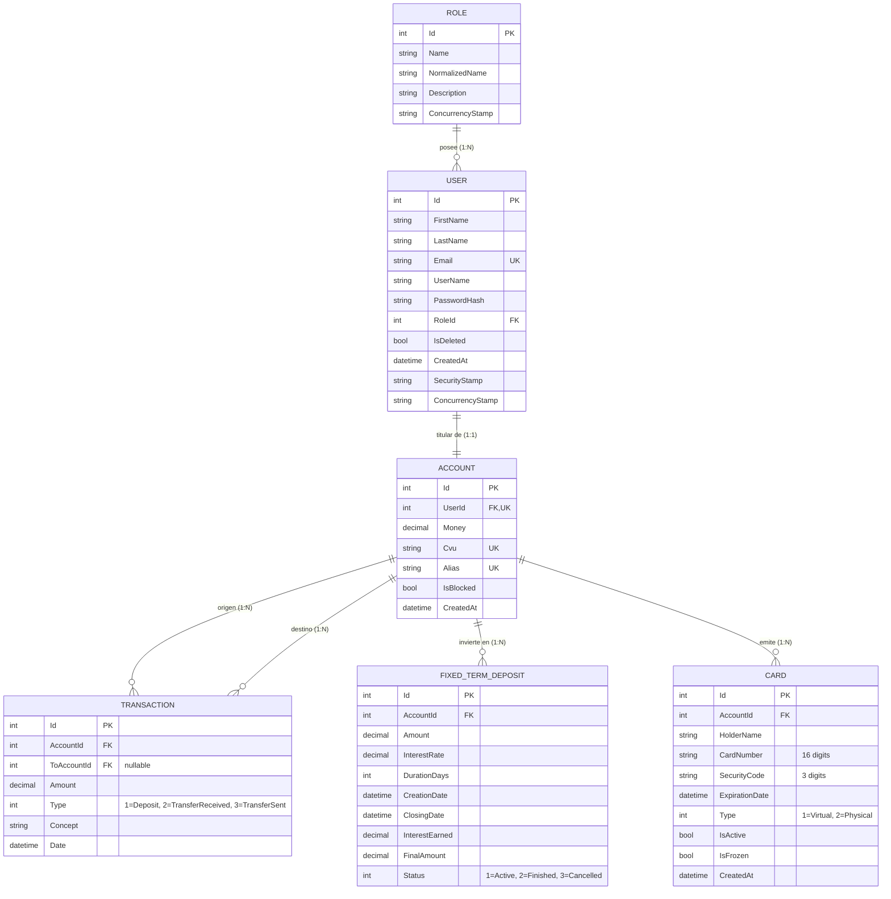

# DigitalArs — Billetera Virtual (Backend API)

> **Proyecto:** Billetera Virtual / Digital Wallet  
> **Programa:** Aceleración Técnica en **Alchemie Acceleration Tech**  
> **Equipo:** **Squad-stack** — Emmanuel, Andrés, Micaela y Máximo  
> **Stack Principal:** .NET 10 | ASP.NET Core Web API | Entity Framework Core | SQL Server | ASP.NET Core Identity | JWT Bearer  

---

## 1. Descripción del Proyecto

**DigitalArs** es una solución fintech integral construida con arquitectura limpia (*Clean Architecture*) y estándares empresariales. Proporciona una API RESTful de alto rendimiento para la gestión financiera segura de cuentas bancarias virtuales, procesamiento de transferencias atómicas entre usuarios (por CVU, Alias o Cuenta), depósitos con comprobante, simulación y constitución de plazos fijos de inversión, emisión y administración de tarjetas (virtuales y físicas), y un panel de control administrativo con control de accesos basado en roles (*RBAC*).

---

## 2. Arquitectura del Sistema (Clean Architecture)

El backend está organizado en cuatro capas estrictamente desacopladas para garantizar alta mantenibilidad, testabilidad y separación de responsabilidades:

```
DigitalArs.slnx
├── DigitalArs.Domain/           # Capa de Dominio: Entidades de negocio puras, enums y reglas independientes
├── DigitalArs.Application/      # Capa de Aplicación: Interfaces de servicios, DTOs, validaciones y lógica de negocio
├── DigitalArs.Infrastructure/   # Capa de Infraestructura: Entity Framework Core, ApplicationDbContext, Repositorios, Servicios y Migraciones
├── DigitalArs.Api/              # Capa de Presentación: Controllers REST, Middlewares, Filtros, Swagger y Program.cs
└── DigitalArs.UnitTests/        # Pruebas Unitarias: Tests automatizados con xUnit, Moq y FluentAssertions
```

### Inyección de Dependencias Modular
La configuración de servicios se encuentra desacoplada mediante métodos de extensión:
- `services.AddApplication()`: Registra validadores y configuraciones de aplicación.
- `services.AddInfrastructure(configuration)`: Registra `ApplicationDbContext`, Identity, Repositorios genéricos, Unit of Work y servicios de infraestructura (`AccountService`, `TransactionService`, `FixedTermDepositService`, `CardService`, `JwtTokenGenerator`).

---

## 3. Stack Tecnológico

| Componente | Tecnología | Versión | Rol en la Solución |
| :--- | :--- | :---: | :--- |
| **Runtime & SDK** | [.NET](https://dotnet.microsoft.com/) | `10.0` | Framework de ejecución principal de alto rendimiento |
| **Web Framework** | [ASP.NET Core](https://learn.microsoft.com/aspnet/core) | `10.0` | Creación de controladores RESTful, middlewares y pipeline HTTP |
| **ORM** | [Entity Framework Core](https://learn.microsoft.com/ef/core) | `10.0` | Mapeo objeto-relacional con enfoque *Code First* y Fluent API |
| **Motor de Base de Datos** | Microsoft SQL Server / LocalDB | `2022+` | Base de datos relacional con integridad referencial e índices optimizados |
| **Seguridad e Identidad** | ASP.NET Core Identity | `10.0` | Gestión de usuarios, roles, claims y hash seguro de contraseñas |
| **Autenticación** | JWT (JSON Web Tokens) | `Bearer` | Tokens firmados criptográficamente con `HMAC-SHA256` |
| **Documentación API** | OpenAPI / Swagger UI | `Swashbuckle 7.0` | Explorador interactivo y documentación viva de endpoints |
| **Colección Postman** | Postman Collection v2.1 | `2.1` | Colección completa con variables de entorno y auto-guardado de token |
| **Testing Automatizado** | xUnit & Moq | `2.9+` | Suite de pruebas unitarias y mocks para lógica de servicios |

---

## 4. Requisitos Previos

Antes de clonar y ejecutar el proyecto, asegúrese de tener instalado:
1. **[.NET 10 SDK](https://dotnet.microsoft.com/download/dotnet/10.0)** (o superior).
2. **Microsoft SQL Server** (LocalDB incluido con Visual Studio, SQL Server Express o instancia de SQL Server en Docker).
3. **IDE / Editor:** Visual Studio 2022+, VS Code (con C# Dev Kit), Rider o Antigravity IDE.
4. **Herramienta EF Core CLI:**
   ```bash
   dotnet tool install --global dotnet-ef
   ```

---

## 5. Instalación y Puesta en Marcha

### Paso 1: Clonar el Repositorio
```bash
git clone https://github.com/MicaMulato/Squad-stack.git
cd Squad-stack
```

### Paso 2: Configurar la Cadena de Conexión y JWT
Verifique la cadena de conexión en `DigitalArs.Api/appsettings.json` o configure su entorno local en `DigitalArs.Api/appsettings.Development.json`:

```json
{
  "ConnectionStrings": {
    "DefaultConnection": "Server=(localdb)\\MSSQLLocalDB;Database=DigitalArsDb;Trusted_Connection=true;TrustServerCertificate=true;"
  },
  "JwtSettings": {
    "SecretKey": "CAMBIA_ESTA_CLAVE_POR_UNA_PROPIA_DE_AL_MENOS_32_CARACTERES",
    "Issuer": "DigitalArs.Api",
    "Audience": "DigitalArsUsers",
    "ExpirationMinutes": 60
  },
  "Cors": {
    "AllowedOrigins": [
      "http://localhost:5173"
    ]
  },
  "DepositSettings": {
    "MaxAmountPerOperation": 1000000
  }
}
```

### Paso 3: Aplicar Migraciones de Base de Datos y Seed Data
Ejecute el siguiente comando para generar la base de datos `DigitalArsDb` y precargar los datos de prueba iniciales:

```bash
dotnet ef database update --project DigitalArs.Infrastructure --startup-project DigitalArs.Api
```

### Paso 4: Ejecutar la API
```bash
dotnet run --project DigitalArs.Api
```

La API se iniciará de forma predeterminada en:
- **API URL:** `http://localhost:5065` o `https://localhost:7142`
- **Swagger UI:** `http://localhost:5065/swagger`

---

## 6. Credenciales de Prueba (Data Seeding)

La base de datos se inicializa automáticamente con usuarios, cuentas activas, CVU/Alias generados, saldos e historial de movimientos:

| Rol | Nombre | Email | Contraseña | Saldo Inicial | Estado |
| :--- | :--- | :--- | :--- | :---: | :---: |
| **Admin** | Administrador DigitalArs | `admin@digitalars.com` | `Admin123!` | $500.000,00 | Activo |
| **User** | Roberto Carlos | `robercarlos3@gmail.com` | `Roberto1!` | $260.000,00 | Activo |
| **User** | Mohammed Khan | `mokha@gmail.com` | `Mohammed1!` | $185.000,50 | Activo |
| **User** | Alejandro Silva | `alejandro.silva@digitalars.com` | `User123!` | $45.230,50 | Activo |
| **User** | Micaela Mulato | `micaela.mulato@digitalars.com` | `User123!` | $320.000,00 | Activo |
| **User** | Emmanuel Torres | `emmanuel.torres@digitalars.com` | `User123!` | $410.000,00 | Activo |

---

## 7. Diagrama Entidad-Relación (ER Diagram)



---

## 8. Catálogo de Módulos y Endpoints de la API

### 8.1. Autenticación (`/api/auth`)
- `POST /api/auth/login`: Autentica credenciales y emite token JWT con claims de usuario y rol.

### 8.2. Cuentas y Datos Bancarios (`/api/accounts`)
- `GET /api/accounts/me`: Información detallada de la cuenta bancaria del usuario (saldo, CVU de 22 dígitos, Alias y estado).
- `PUT /api/accounts/me/alias`: Actualización del Alias único de la cuenta.
- `GET /api/accounts/lookup?query={cvuOrAlias}`: Búsqueda y validación de destinatario en tiempo real por CVU o Alias.
- `POST /api/accounts/deposit`: Acreditación de fondos propios en cuenta.
- `GET /api/accounts/{id}`: Detalle de una cuenta por ID (Solo Administradores).

### 8.3. Transferencias y Transacciones (`/api/transactions`)
- `POST /api/transactions/transfer`: Transferencia atómica entre cuentas con verificación de saldo, cuenta activa y generación de asientos dobles (débito y crédito).
- `GET /api/transactions/me`: Historial paginado de movimientos con filtros por tipo, rango de fechas y montos.

### 8.4. Inversiones a Plazo Fijo (`/api/fixed-deposits`)
- `POST /api/fixed-deposits/simulate`: Simulador público de rendimiento según capital y días (sin comprometer saldo).
- `POST /api/fixed-deposits`: Constitución de plazo fijo debitando saldo disponible según TNA (Tasa Nominal Anual) pactada.
- `GET /api/fixed-deposits/me`: Listado de plazos fijos del usuario (activos, finalizados y cancelados).

### 8.5. Tarjetas Virtuales y Físicas (`/api/cards`)
- `POST /api/cards/virtual`: Emisión instantánea de tarjeta de débito virtual.
- `GET /api/cards/me`: Listado de tarjetas activas asociadas a la cuenta (datos enmascarados).
- `GET /api/cards/{id}/reveal`: Revelación segura de datos sensibles (PAN completo de 16 dígitos y código CVV).
- `PATCH /api/cards/{id}/freeze`: Congelamiento y descongelamiento temporal de tarjeta.
- `DELETE /api/cards/{id}`: Baja definitiva de tarjeta.

### 8.6. Administración y Gestión de Usuarios (`/api/users`)
- `GET /api/users/me`: Consulta de perfil propio.
- `PUT /api/users/me`: Actualización de perfil propio y cambio de contraseña.
- `GET /api/users`: Listado paginado de usuarios con saldo de cuenta y roles asignados (Solo Administradores).
- `GET /api/users/{id}`: Información detallada de un usuario por ID (Solo Administradores).
- `POST /api/users`: Alta de nuevo usuario con asignación de cuenta, CVU, Alias y saldo inicial (Solo Administradores).
- `PUT /api/users/{id}`: Modificación de datos personales, correo o rol de un usuario (Solo Administradores).
- `DELETE /api/users/{id}`: Baja lógica (*Soft Delete*) y bloqueo de usuario (Solo Administradores).

---

## 9. Colección de Postman

El proyecto incluye una colección completa y su entorno de variables en `docs/postman/`:
- **Colección:** `docs/postman/DigitalArs.postman_collection.json`
- **Entorno:** `docs/postman/DigitalArs.postman_environment.json`

La colección cuenta con un script de prueba en los endpoints de Login que guarda automáticamente el `token` JWT en el entorno, permitiendo ejecutar cualquier endpoint autenticado sin configuración manual.

---

## 10. Pruebas Automatizadas

Para ejecutar toda la suite de pruebas unitarias:

```bash
dotnet test
```

---

## 11. Equipo de Desarrollo (Squad-stack)

- **Emmanuel Torres**
- **Andrés**
- **Micaela Mulato**
- **Máximo Porretti**
