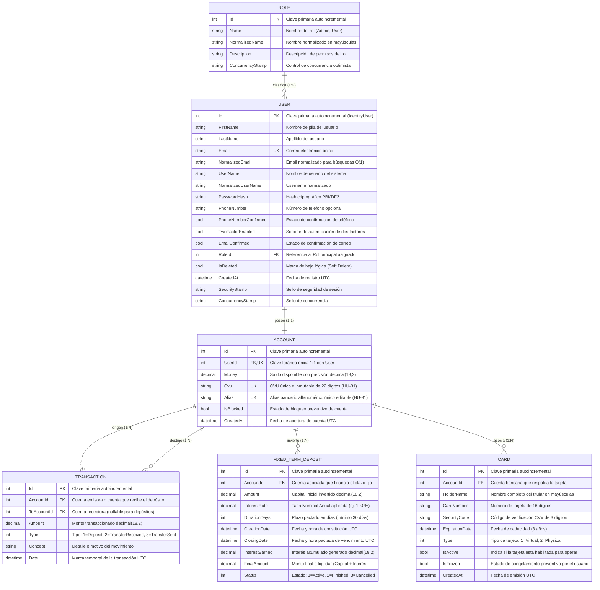

# Diagrama Entidad-Relación — Billetera Virtual DigitalArs

> **Documento:** Especificación del Modelo de Datos Relacional  
> **Sistema:** DigitalArs API (.NET 10 + Entity Framework Core 10 + SQL Server)  
> **Versión:** 2.1 (Actualizado con Identificadores Bancarios Interoperables: `Cvu` y `Alias`, más `Card` y `FixedTermDeposit`)  

---

## 1. Diagrama Mermaid

---

## 2. Descripción Detallada de Entidades y Relaciones

### 2.1. `User` (Usuarios del Sistema)
- Hereda de `IdentityUser<int>` provisto por ASP.NET Core Identity.
- Se implementó un patrón de **baja lógica (*Soft Delete*)** mediante la propiedad `IsDeleted`.
- Índice no agrupado único sobre `NormalizedEmail` e índice sobre `IsDeleted` para acelerar consultas de usuarios activos.
- En la capa de aplicación, la creación y edición validan la unicidad del email incluso contra registros con baja lógica (`IgnoreQueryFilters`), impidiendo colisiones en base de datos.

### 2.2. `Role` (Roles y Permisos)
- Hereda de `IdentityRole<int>`.
- Soporta roles principales: `Admin` (Id: 1) y `User` (Id: 2).

### 2.3. `Account` (Cuenta Monetaria e Identificadores Bancarios)
- Relación **1 a 1** estricta con `User`. Cada usuario registrado dispone exactamente de una cuenta monetaria en pesos (ARS).
- **`Cvu`**: Clave Virtual Uniforme de **22 dígitos numéricos**. Es única a nivel de base de datos (`IX_Accounts_Cvu`) e inmutable una vez asignada al crearse la cuenta (HU-31).
- **`Alias`**: Identificador alfanumérico legible único (`IX_Accounts_Alias`, formato `palabra1.palabra2.ars`) de hasta 50 caracteres. Es editable por el usuario desde su perfil con validación de unicidad en tiempo real.
- La columna `Money` almacena el saldo con tipo de datos `decimal(18,2)` para prevenir desbordes o imprecisiones de punto flotante.
- Incluye la propiedad `IsBlocked` para inhabilitar operaciones de débito o transferencia si se detecta actividad sospechosa.

### 2.4. `Transaction` (Movimientos y Transferencias)
- Registra cualquier mutación monetaria en el sistema.
- Relación **1 a N** con `Account` a través de `AccountId` (cuenta de origen/débito).
- Relación opcional con `ToAccountId` para identificar la cuenta de destino en transferencias interbancarias.
- Enumeración `TransactionType`:
  - `Deposit` (1): Depósito directo de fondos en la propia cuenta.
  - `TransferReceived` (2): Transferencia entrante acreditada desde otra cuenta.
  - `TransferSent` (3): Transferencia saliente debitada hacia otra cuenta.

### 2.5. `FixedTermDeposit` (Inversiones a Plazo Fijo)
- Relación **1 a N** con `Account`.
- Permite la inmovilización de fondos por períodos de tiempo configurables (mínimo 30 días) a una TNA (Tasa Nominal Anual) parametrizada.
- Al constituirse, debita el monto del saldo disponible y calcula el retorno final (`FinalAmount = Amount + InterestEarned`).
- Estados soportados (`FixedTermDepositStatus`):
  - `Active` (1): Plazo fijo en curso devengando intereses.
  - `Finished` (2): Plazo fijo completado y liquidado con intereses acreditados.
  - `Cancelled` (3): Plazo fijo rescindido anticipadamente con devolución de capital.

### 2.6. `Card` (Tarjetas de Débito/Crédito)
- Relación **1 a N** con `Account`.
- Permite emitir tarjetas virtuales o físicas asociadas a la cuenta.
- Propiedad `IsFrozen` para pausar instantáneamente compras y transacciones con la tarjeta sin cancelarla.

---

## 3. Restricciones de Integridad y Borrado en Cascada
- Para evitar la pérdida accidental de datos contables e históricos, las relaciones hacia `Transaction`, `FixedTermDeposit` y `Card` utilizan la regla `DeleteBehavior.Restrict` / `DeleteBehavior.NoAction`.
- La eliminación de usuarios se gestiona mediante *Soft Delete*, garantizando que ningún registro transaccional quede huérfano.
